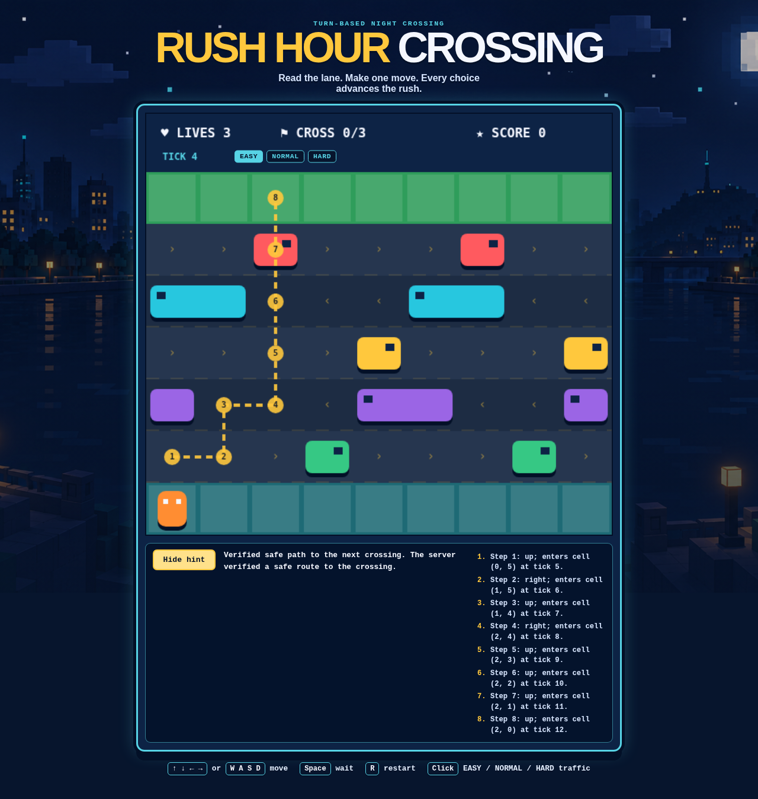
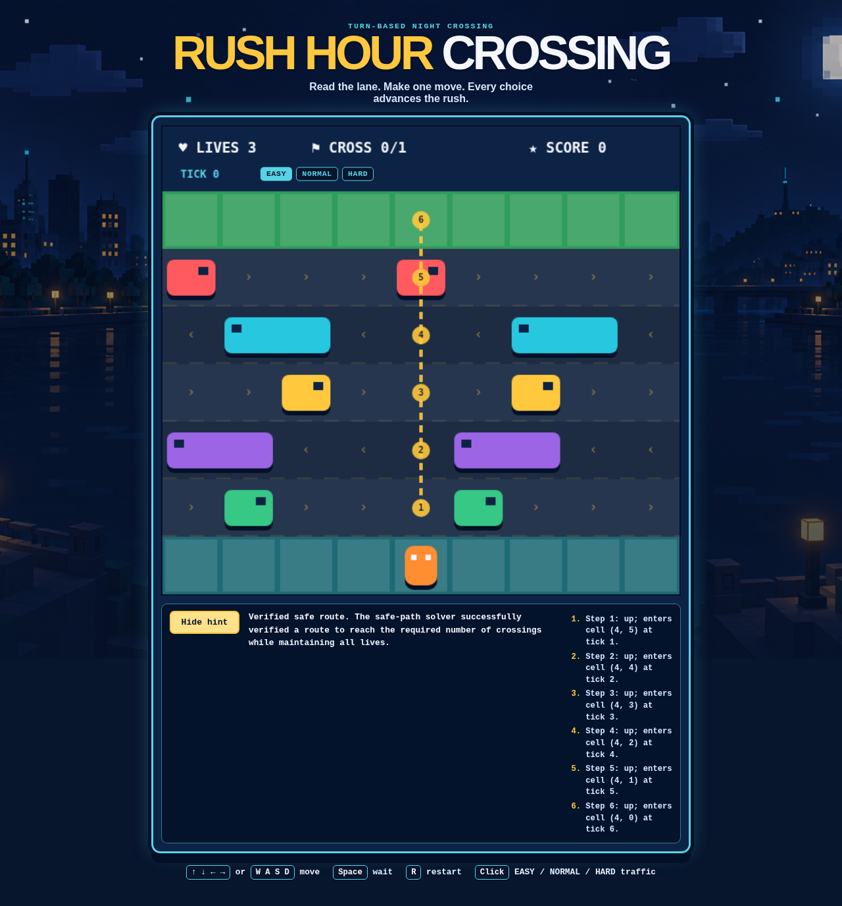

# W05 Evidence — Bounded Safe-Path Hint

## Scope and authorization

- On 2026-10-06, the user confirmed that their request represents the student pair's approval for the narrow in-game safe-path Hint/tool-calling exception. The exception is recorded in `docs/GAME_SPEC.md` and `docs/AI_USAGE_LOG.md`.
- The approved exception adds one player-triggered, read-only Hint flow using the sole allowlisted `find_safe_path({})` tool. A Hint ends after the next safe crossing at any column on the top row; gameplay still wins at the configured `crossingsToWin`. One request is allowed per life count. Rules R1–R7, presets, and feature 006 remain unchanged.
- Feature artifacts are in `specs/007-ai-bounded-feature/`. Original evaluation expectations E1–E12 cover the initial implementation. Follow-up expectations E13–E14 cover the requested next-crossing and per-life corrections. Automated tests use fake provider adapters and route interception. The earlier explicitly approved live flow succeeded; no additional live Gemini request was made for this correction.
- The bounded solver returns only replay-verified route steps. The browser sends only the eight-field active snapshot and uses same-origin `/api/hint`.

## Test-first evidence

Expectations and tests were added before the behavior slice they cover. The pre-change baseline outputs were:

| Command | Actual result |
|---|---|
| `npm exec vitest run tests/hints/contract.test.ts tests/hints/solver.test.ts tests/server/hint-service.test.ts tests/server/hint-api.test.ts tests/server/boundaries.test.ts` | Exit 1; 5 test files failed. The four new behavior suites could not load their not-yet-created modules; the boundary suite had 1 failing importer expectation and 4 passing checks. |
| `./node_modules/.bin/vitest run tests/hints/lifecycle.test.ts tests/hints/client.test.ts --reporter verbose --maxWorkers=1` | Exit 1; both suites reported the expected missing `src/hints/lifecycle` and `src/hints/client` modules; no tests ran. |
| `./node_modules/.bin/playwright test e2e/hint.pw.ts --reporter=line` | Exit 1 before browser tests started: Playwright's web server could not start because the in-progress build/typecheck had unresolved feature implementation errors. The exact blocking type errors were fixed before final browser verification. |
| `npm run test:run -- tests/server/hint-gemini-provider.test.ts` (before fixes) | Exit 1: the explanation schema used uppercase JSON Schema type names; later regression expectations also exposed the empty tool parameter schema and missing tool declaration in the continuation request. |
| `npm exec vitest run tests/hints/lifecycle.test.ts tests/hints/controller.test.ts` (per-life red baseline) | Exit 1; 5 failures / 5 passes. The lifecycle had no used-life history and the controller had no life-change transition. |
| `npm exec vitest run tests/hints/solver.test.ts tests/hints/contract.test.ts tests/server/hint-service.test.ts` (next-crossing red baseline) | Exit 1; 4 failures / 43 passes. The solver returned 13–15 steps to finish all configured crossings; the response contract rejected a valid active state after the next crossing. |

The default sandbox blocked loopback binds in the new API test (`listen EPERM`); the focused and full server suites were then run with local loopback access and passed. The initial default `npm ci` also hit a sandbox `spawnSync esbuild EPERM`; rerunning the same clean install with local process permission succeeded.

## Implementation evidence

- **Contracts/API**: Exact snapshot/tool/response validators enforce ranges, route steps, origin match, and body caps. `POST /api/hint` validates before calling the service, aborts on disconnect, returns fixed errors, keeps the existing Host allowlist/security headers, and adds no CORS.
- **Agent/solver**: The provider proposal must be exactly one `find_safe_path` call with `{}`. Gemini's function declaration omits `parameters` for this zero-argument function; an omitted response `args` is normalized to `{}` and then exact-validated. The second request includes the original user turn, original function declaration, and function response, with function calling set to `NONE` so it returns only the explanation. The explanation schema uses JSON Schema lowercase type names. The server executes the deterministic BFS once, replays the full trace with `applyAction`, and gives the model only a compact validated summary for its short explanation. Route data always comes from the solver. The run is bounded to four provider attempts (two per step), 15 seconds per attempt, 45 seconds total, 30,000 expanded states, and 512 actions.
- **One-shot solver timing**: From the start position with one crossing target and three lives, easy verified in 6 actions at 1.98 ms, normal in 11 actions at 2.74 ms, and hard in 15 actions at 2.50 ms. These single observations are not latency guarantees.
- **Browser**: One run is available per current life count. Loading and visible results pause keyboard input and disable difficulty controls. Hide resumes input and returns focus to the canvas; showing a cached result makes no new request and labels the original tick. Losing a life clears the cached result and allows one new request; restart/difficulty change resets all used-life counts. Verified steps are drawn and also rendered as an accessible ordered text list. Outcome copy distinguishes exhaustive no-route, search-limit, stale, and unavailable results; model explanation is assigned through `textContent`.
- **Presentation boundary**: Hint status and route-step copy live in pure helpers in `src/hints/messages.ts`. The route overlay is optional in `renderGame`, so callers that omit it retain the existing rendering path.
- **Dependency review**: The required audit first identified `source-map-js` 1.2.1 as high severity. `npm audit fix` changed only the lockfile entry to 1.2.2; `package.json` dependencies were not changed. The final audit is clean.
- **Hint API screenshot**: [w05-hint-api-verified.png](evidence/w05-hint-api-verified.png) was captured in a browser after a real HTTP `POST /api/hint` to the local request handler returned HTTP 200 for `crossingsToWin=3`. From column 0 at tick 4, the shortest route ends at top-row column 2 after one crossing; the game remains active. The provider adapter was a deterministic fixture, so this screenshot is API and solver evidence, not evidence of a Gemini response.

- **Live provider screenshot**: [w05-hint-live-verified.png](evidence/w05-hint-live-verified.png) shows the successful final live Gemini flow. The opt-in browser test asserts HTTP 200, validates the response against the original snapshot, compares every route step to the deterministic solver, and checks the visible status/list before saving the screenshot.

- **Opt-in live evidence test**: `e2e/hint-live-evidence.pw.ts` is skipped unless `RUN_LIVE_HINT_EVIDENCE=1` is set, so default test runs do not contact Gemini. The approved final run passed.

## Final verification

Environment: Node `v24.20.0`, npm `11.19.0`.

| Command | Final result |
|---|---|
| `npm ci` | Passed; 86 packages added, 0 vulnerabilities. |
| `npm run typecheck` | Passed for browser and server TypeScript projects. |
| `npm run test:run` | Passed after the behavior correction: 26 files, 232 tests. This includes next-crossing route contracts, per-life lifecycle, API, service, provider request-shape, and boundary coverage. |
| `npm run build` | Passed after the behavior correction; Vite transformed 26 modules. Browser JS: 19.80 kB (7.31 kB gzip); CSS: 4.61 kB (1.67 kB gzip). |
| `npm audit --audit-level=high` | Passed: 0 vulnerabilities. |
| `npm run test:e2e` | Passed after the behavior correction: 27 tests across smoke, advice, and Hint suites. Hint coverage includes a local HTTP API integration at `crossingsToWin=3` that stops at the next crossing, per-life Hint requests after deterministic life losses, pause/cache/reset, accessible route list, reduced-motion loading, literal-text rendering, and distinct safe outcomes. |
| Prior approved `RUN_LIVE_HINT_EVIDENCE=1 npx playwright test e2e/hint-live-evidence.pw.ts` run | Passed before this behavior correction: 1 explicitly approved live Gemini Hint flow at a one-crossing target. It returned HTTP 200 and matched the deterministic solver. It was not repeated; no further live provider call was made. |
| `git diff --check` | Passed with no whitespace errors. |

### Exposure and regression review

- Boundary tests passed. `src/` has no server, Node, Gemini SDK, or environment imports; only the two server provider adapters import `@google/genai`.
- The final browser JavaScript bundle was scanned for `@google/genai`, `GEMINI_API_KEY`, `gemini-3.1-flash-lite`, and `process.env`: one bundle scanned, zero markers found.
- `server/agent/` logs only fixed failure categories, workflow stage, and HTTP status; it never logs provider messages, request payloads, or credentials. API/service tests confirm fixed error bodies and compact model evidence; the fake provider ran in automated tests.
- The ignored `.env` contents were not displayed, copied, or included in evidence. The live server used its normal environment loader. No tracked `.env` file or credential value was added. Pre-existing unrelated untracked assignment, report, plan, and asset materials were preserved.
- Existing game, preset, golden-path, advice, smoke, and API checks passed in the final full suites. `src/game/turn.ts` only exports and reuses the same destination helper that was previously private; the transition behavior was not otherwise changed.

## Known limits and student contributions

- Five explicitly approved live Hint flows initially returned HTTP 503. Safe diagnostics recorded HTTP 504 on a safe-path tool-call attempt and HTTP 400 on explanation attempts; one explanation response contained another function call instead of text. The current code preserves the original user turn and tool declaration and disables further function calls during explanation. The sixth approved flow passed HTTP 200 and matched the deterministic solver; its screenshot is linked above. This verifies one current account/configuration and snapshot, not every future provider condition.
- A safe route that needs more than 512 actions or exceeds the expansion cap is reported as `search_limit`, not as proof of no route.
- The implementation record initially did not identify individual roles. The learner later reported that Igor Nenadovic researched the ideas, selected the Hint, and directed Codex through prompts for the specification, code, and tests; Aleksa Durutovic reviewed the tests, manually checked the API integration, gave feedback, and added missing corrections. This split is learner-reported, not inferred from Git metadata. OpenAI Codex generated and implemented the feature code under that direction.

## Spec Kit workflow notes

- The local prerequisite script could not run because `pwsh` is not installed (`/bin/bash: pwsh: command not found`); feature paths and artifacts were checked directly.
- The requirements checklist is 18/18. The 20 functional requirements and 8 success criteria map to 33 tasks; manual cross-artifact analysis found no unresolved placeholders or critical/high coverage conflicts. `.specify/extensions.yml` is absent, so no hooks are registered.

## User-requested behavior correction — 2026-10-06

- The user clarified that gameplay must continue to use `crossingsToWin`; a Hint should show only the shortest safe path to the next crossing, which is the first safe entry to any column on the top row. If that crossing does not reach the configured target, the game remains active. The refreshed screenshot reaches column 2 from an off-center start at column 0.
- The user also requested one Hint attempt per current life count. A failed/stale attempt consumes that count's allowance. On life loss, the cached route is cleared and a new attempt becomes available for the new count. Restart/difficulty resets all counts.
- Red baselines are in the Test-first evidence table. After correction, `npm run typecheck` passed through `npm run build`, the targeted unit/service set passed (5 files / 57 tests), the full Vitest suite passed (26 files / 232 tests), and Playwright passed (27 tests). `w05-hint-api-verified.png` was regenerated from a local HTTP 200 response using a deterministic provider fixture and `crossingsToWin=3`; it shows one crossing route while the game remains active.
- The one-time live Gemini check was not repeated because the user described it as the last request. The earlier successful live check used `crossingsToWin=1`; the corrected multi-crossing behavior is verified through the real local API handler with a deterministic provider fixture.
- The required Speckit PowerShell prerequisite remains unavailable (`pwsh: command not found`). The feature checklist was read directly and all 18 items are checked. `.specify/extensions.yml` is absent, so no extension hooks apply. No dependency files changed in this correction; the earlier clean high-severity audit result remains applicable.

## W05 Hint life-cache invalidation correction — 2026-10-06

- **Claim**: A Hint result must not carry into a different life, and the new life count must be allowed its own request.
- **Test-first signal**: A new lifecycle regression failed before the fix: a verified cached result remained visible after the life count changed.
- **Change**: Any recorded Hint snapshot whose life count differs from the current count is cleared, its generation is invalidated, and an in-flight request is aborted. Used life counts remain recorded. The browser regression now returns a verified route, loses a life, checks the old status and route are cleared, then verifies the next request uses the new life and current tick.
- **Checks**: `npm exec vitest run tests/hints/lifecycle.test.ts tests/hints/controller.test.ts` passed (2 files, 12 tests). `npm run build` passed, including typechecking and Vite production build. `node_modules/.bin/playwright test --list e2e/hint.pw.ts` discovered all five Hint tests. The first targeted Playwright attempt could not start in the default sandbox (`listen EPERM`) before browser execution. At the learner's request, the same test was run three times with local process access: all three passed (1 test each; 4.9, 5.1, and 4.9 seconds). Port 4173 was not serving an app before the second and third runs, so Playwright started its own server. The test verifies that life loss clears the old route and the next request uses the new life count and current tick. No Gemini call was made.
